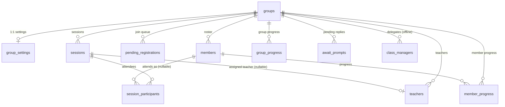
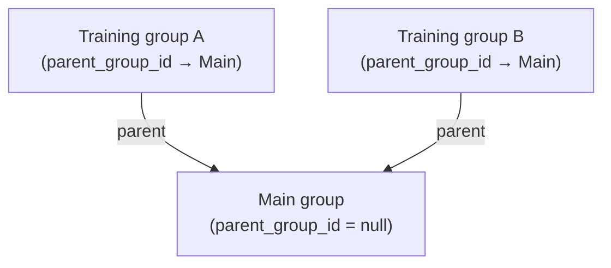
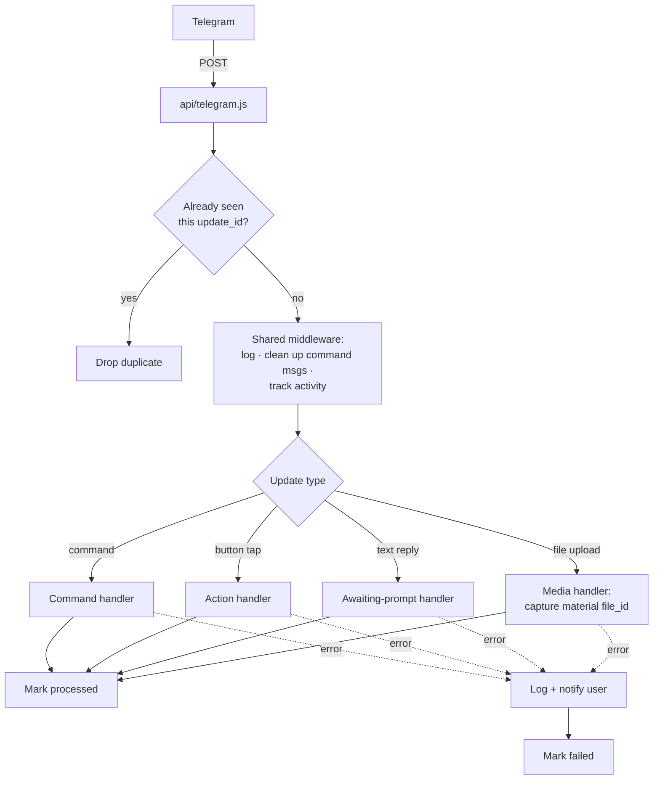
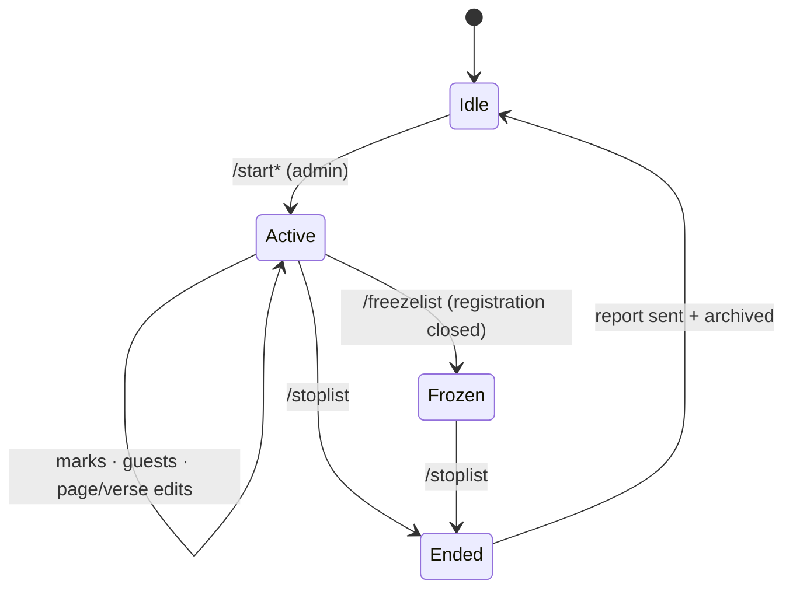
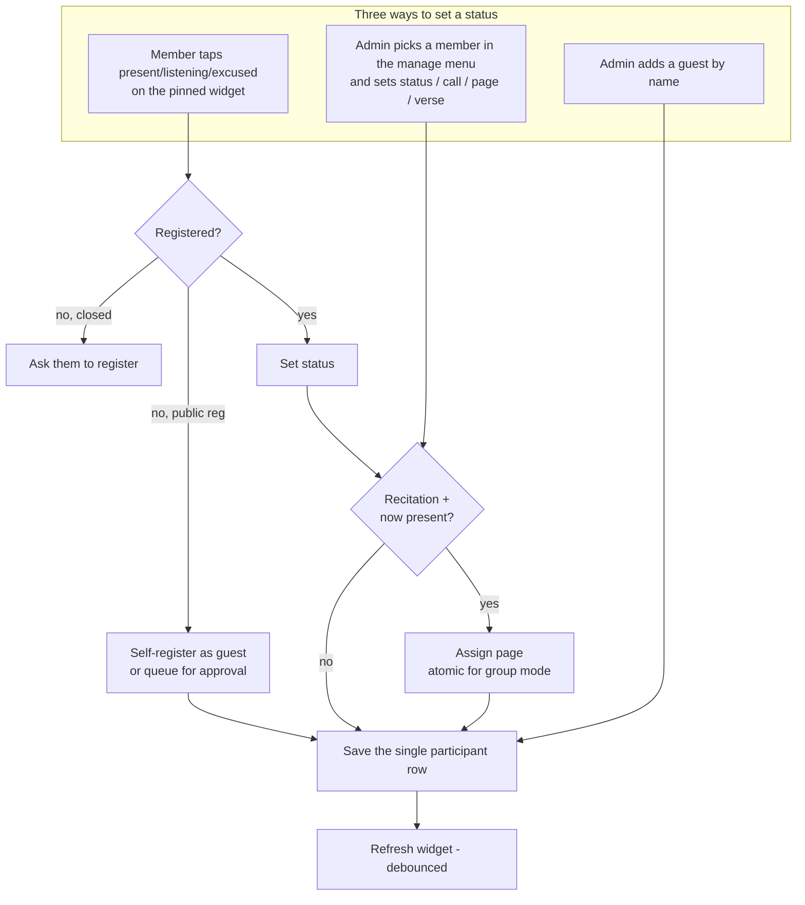
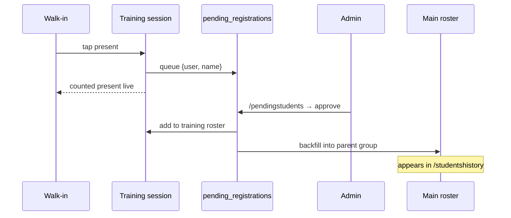
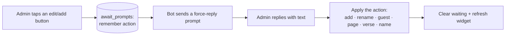

# Bot Flows & Data Model — Deen Circles Attendance Bot

A guided tour of how the bot is wired: the data it stores, how a Telegram
update travels through the code, and the main day-to-day flows. Diagrams are
Mermaid (render in GitHub, VS Code preview, and most Mermaid viewers).

**Mental model in one paragraph:** an admin starts a *session* in a group
(attendance list, recitation, etc.). Members and walk-ins mark themselves
present on a pinned widget, or an admin sets statuses from a manage menu. When
the session stops, a report is sent and the session is archived. Everything is
stored in a Supabase (Postgres) database keyed by *group*.

Contents:
1. [Data model](#1-data-model)
2. [How an update is processed](#2-how-an-update-is-processed)
3. [Commands at a glance](#3-commands-at-a-glance)
4. [Session lifecycle](#4-session-lifecycle)
5. [Marking attendance](#5-marking-attendance)
6. [Registration & members](#6-registration--members)
7. [Training-group walk-ins](#7-training-group-walk-ins)
8. [Text-reply prompts](#8-text-reply-prompts)
9. [History & reports](#9-history--reports)
10. [Admin control hub (`/manage`)](#10-admin-control-hub-manage)
11. [Offline (DM) classes & delegation](#11-offline-dm-classes--delegation)
12. [Appendix: callback prefixes](#12-appendix-callback-prefixes)

---

## 1. Data model

Everything hangs off a **group** (one Telegram chat). A group owns its members,
teachers, pending join requests, sessions, and progress counters. Each session
in turn owns the participant rows that record who attended.

### Relationships



**Group hierarchy (`parent_group_id`).** A group can also point at another group
via `parent_group_id`. This is used one way only: a *training* group names its
*main* group as parent, so approved walk-ins backfill into the main roster (§7).
A main group leaves `parent_group_id` empty.



- **`groups` is the hub** — nearly every table has a `group_id` foreign key back
  to it, and deleting a group cascades to its children.
- **`groups.parent_group_id`** is a self-reference (see the hierarchy diagram
  above): a *training* group points at its *main* group so walk-ins can be
  backfilled (see §7).
- **`session_participants`** joins a session to *either* a member (`member_id`)
  *or* a guest (`guest_name`) — never both.
- **`processed_updates`** is standalone (no foreign keys) — just a dedupe log.

### Every table

```mermaid
erDiagram
    groups {
        bigint id PK
        text telegram_chat_id UK
        text title
        int current_series "term counter"
        timestamptz last_activity_at
        bigint parent_group_id FK "self → main group"
        text owner_user_id "set for offline (DM) classes"
    }
    group_settings {
        bigint group_id PK "FK to groups"
        jsonb training_groups
        int retention_days
    }
    members {
        bigint id PK
        bigint group_id FK
        text telegram_user_id "UK with group"
        text name "UK with group when active"
        bool active
        bigint training_group_id "offline: student's sub-group (nullable)"
    }
    teachers {
        bigint id PK
        bigint group_id FK
        text telegram_user_id "UK with group"
        text name
        text[] teacher_types "course/training/recitation/homework (multi-role)"
        bool active
    }
    pending_registrations {
        bigint id PK
        bigint group_id FK
        text telegram_user_id
        text name
        text username
        text status "pending/approved/dismissed"
    }
    sessions {
        uuid id PK
        bigint group_id FK
        text session_type "main/open/training/..."
        text name
        int series_id
        bool active "one active per group"
        bool registration_active
        bool allow_public_registration
        bigint widget_message_id
        int group_recitation_next_page "atomic allocator"
        bool archived
        jsonb metadata
        bigint teacher_id FK "assigned teacher (nullable)"
    }
    session_participants {
        bigint id PK
        uuid session_id FK
        bigint member_id FK "null for guests"
        text guest_name "null for members"
        text display_name
        text attendance_status "present/listening/excused/absent"
        text called_state "responding/responded/away"
        text pages
        text verse
    }
    member_progress {
        bigint id PK
        bigint group_id FK
        bigint member_id FK
        text mode "personal/groupRecitation"
        text page_value
    }
    group_progress {
        bigint group_id PK "FK to groups"
        text mode PK "groupRecitation"
        int next_page
    }
    await_prompts {
        bigint id PK
        bigint group_id FK
        text telegram_user_id "UK with group"
        text action
        bigint prompt_message_id
        bool awaiting_prompt
        jsonb payload
        timestamptz expires_at
    }
    processed_updates {
        bigint update_id PK
        text status "processing/processed/failed"
        int retry_count
        text last_error
    }
    class_managers {
        bigint group_id FK "PK with user_id"
        text user_id "PK with group_id"
        text manager_role "operator/assistant"
        text display_name
        text added_by
    }
```



### What each table is for

| Table | Purpose |
|-------|---------|
| `groups` | One row per Telegram chat. `current_series` counts terms; `parent_group_id` links a training group to its main group. |
| `group_settings` | Per-group config: linked training groups, data-retention days. One row per group. |
| `members` | The registered roster. Unique per `(group, telegram_user_id)` and per active name. |
| `teachers` | Teachers for a group. Each teacher holds a **set of roles** in `teacher_types text[]` (course / training / recitation / homework) — a teacher may hold several at once. |
| `pending_registrations` | People who asked to join (`/myid`, register widget) awaiting admin approval. |
| `sessions` | Each attendance run. Only **one** can be `active` per group. Type drives the rules (see §4). |
| `session_participants` | One row per attendee per session — a **member** (`member_id`) or a **guest** (`guest_name`), never both. Holds status, call state, page, verse. |
| `member_progress` | Cross-session recitation position per member (personal / group modes). |
| `group_progress` | Group-wide next recitation page (group mode). |
| `await_prompts` | Tracks "waiting for the admin's next text reply" (see §8). One row per `(group, admin)`. |
| `processed_updates` | Dedupe log so a Telegram retry can't double-process an update. No foreign keys. |
| `class_managers` | Delegates for **offline (DM) classes** (see §11). One row per `(group, user)` with a `manager_role` of `operator` or `assistant`. The class owner stays in `groups.owner_user_id`. |
| `class_materials` | Teaching materials per class. A row is a *lesson* (a `title`) that owns one or more files in `class_material_files`. Soft-deleted via `active`. Its files are reused to resend the lesson on demand (see §10/§11). |
| `class_material_files` | Files attached to a lesson. Stores only Telegram's `file_id` (Telegram hosts the bytes) plus `file_type` (`document` / `photo` / `video` / `audio`) and a 1-based `position`. Cascade-deleted with the lesson, or hard-deleted one at a time from the manage-files view. |
| `homework` | Homework items per class. Group items carry a `source_message_id` (the tagged assignment post in the linked homework group); offline items have `null`. Soft-deleted via `active`. The linked homework group's Telegram chat id lives on `group_settings.homework_group_id`. |
| `homework_submissions` | One row per `(homework, member)`. Tracks `submission_message_id` (the student's reply), plus `reviewed` / `reviewed_by` / `reviewed_at` when a teacher reviews it. Unique on `(homework_id, member_id)`. |
| `class_schedule` | Recurring **weekly roster** slots per class. One row per slot: a `session_type` (`main` / `registeredSecondary` / `training` / `homeworkReview`) on a `day_of_week` (0=Sun..6=Sat) at a `time_of_day`, with an optional assigned `teacher_id`. `homeworkReview` is **all-day** — its `time_of_day` is the sentinel `'allday'` (no fixed hour, timezone-agnostic). Plan-only — slots do not create attendance sessions. See §11. |
| `user_prefs` | Per-viewer display preferences (one row per user): preferred **view timezone** and **week start** used to render `/myweek` and the per-class weekly view. |

**Two things worth remembering:**
- A participant is a member **or** a guest — the row uses `member_id` for
  registered people and `guest_name` for walk-ins.
- Group-recitation page numbers come from `allocate_group_recitation_page()`, a
  single locked DB update, so simultaneous taps never grab the same page.

**Offline (DM) classes reuse the same tables.** A DM-managed class is just a
`groups` row whose `telegram_chat_id` is synthetic (`offline:<owner>:<uuid>`)
and whose `owner_user_id` is set. Its roster lives in `members`, its teachers in
`teachers`, its delegates in `class_managers`, its weekly roster in
`class_schedule`, and each session may point at a teacher via
`sessions.teacher_id`. See §11.

---

## 2. How an update is processed

Every Telegram update hits one serverless endpoint, gets de-duplicated, runs
through shared middleware, then reaches the right handler.



- De-duplication only guards the **same** update being redelivered; different
  updates still run as independent, concurrent serverless invocations.
- Command messages in groups are deleted after handling to keep the chat tidy.

---

## 3. Commands at a glance

Access: **A** = admin, **C** = group creator, **—** = anyone.

| Area | Commands |
|------|----------|
| **Info** | `/start` A · `/help` — · `/myid` — · `/groupid` A · `/register` A · `/manage` A (DM hub) |
| **Sessions** | `/startlist` `/startopenlist` `/startsecondarylist` `/startpersonalrecitation` `/startgrouprecitation` `/starttraininglist` (all A) · `/freezelist` A · `/stoplist` A · `/lastreport` — |
| **Members** | `/students` A · `/pendingstudents` A · `/addstudent` A · `/removestudent` A · `/removeallstudents` C |
| **Teachers** | `/addteacher` A · `/addteacherreply` A · `/assignteacher` A (adds a role — multi-role) · `/removeteacher` A · `/listteachers` A · `/tagteachers` A |
| **Training groups** | `/addtraininggroup` `/removetraininggroup` `/listtraininggroups` `/listtrainingstudents` (all A) |
| **History** | `/classhistory` A · `/studentshistory` A · `/newclass` C · `/removeclassrecord` C · `/removestudentrecord` C |
| **Offline (DM)** | `/offline` — (manage private classes in DM; see §11) |
| **Weekly roster** | `/myweek` — (weekly schedule across all your classes, in your preferred timezone; see §11) · `/homework` — (view & submit your homework) |
| **Utility** | `/sortnames` A · `/tagstudents` A · `/feedback` — |

Handlers live under `lib/handlers/commands/`.

---

## 4. Session lifecycle

Only **one** session is active per group. Types differ in who may register and
what extra data is tracked.



On **stop**: a report is posted and the session archived. `main` sessions bump
the group's series counter; recitation sessions carry the next page forward.

| Type | Command | Who can register | Extra tracking |
|------|---------|------------------|----------------|
| `main` | `/startlist` | Registered only | — |
| `open` | `/startopenlist` | Registered + walk-ins | — |
| `training` | `/starttraininglist` | Registered + walk-ins (public) | Walk-ins backfill to parent group |
| `registeredSecondary` | `/startsecondarylist` | Registered only | Verse per member |
| `personalRecitation` | `/startpersonalrecitation` | Registered only | Auto page, cumulative per member |
| `groupRecitation` | `/startgrouprecitation` | Registered only | Auto page, sequential (atomic allocator) |

---

## 5. Marking attendance

A status can be set three ways. Recitation sessions auto-assign a page when
someone becomes "present".



Saves touch only that one participant row (not the whole session), so
concurrent taps can't clobber each other.

---

## 6. Registration & members

```mermaid
flowchart TD
    ASK[User: /myid or register widget] --> Q[(pending_registrations)]
    Q --> REVIEW[Admin: /pendingstudents]
    REVIEW -->|approve| ADD[Add to roster<br/>· optionally as teacher]
    REVIEW -->|dismiss| DROP[Soft-dismiss]

    MANAGE[Admin: /students] --> RENAME[Rename]
    MANAGE --> DELETE[Remove]
    MANAGE --> ASSIGN[Assign to a training group]
    QUICK[/addstudent · /removestudent] --> ADD

    ADD --> LIVE{Session active?}
    LIVE -->|yes| SYNC[Add to session + refresh widget]
    LIVE -->|no| OK[Done]
```

`/removeallstudents` (creator only) wipes the roster and all sessions behind a
confirmation prompt.

---

## 7. Training-group walk-ins

A training group links to a main group via `groups.parent_group_id`. Walk-ins
in a training session are **queued, not auto-added**; approving them also
backfills the parent group's roster so their attendance shows up in reports.



---

## 8. Text-reply prompts

Some actions need free text (a name, a page, a verse). The bot records what it's
waiting for, then the admin's next reply is consumed and applied.



Waiting actions: add member, rename, edit pending registration, add guest, edit
session name, edit page, edit verse, upload teaching material. (`/feedback` uses
a separate mechanism.)

One action reads a **file** instead of text: uploading a teaching material. It
reuses the same force-reply record (`action: 'materialUpload'`), but because
`onText` only fires for text messages, a sibling media handler
(`bot.on(['document','photo','video','audio'])`) consumes the reply, reads the
`file_id`, and uses the message caption as the title (single-step add).

---

## 9. History & reports

```mermaid
flowchart TD
    CH[/classhistory] --> S1[Pick a term/series]
    S1 --> S2[View full report]
    S1 --> S3[Edit a past session]
    S3 --> S4[Pick a member → change status]

    SH[/studentshistory] --> T[Per-student tally:<br/>main attendance · latest verse ·<br/>training attendance]

    RM[Creator-only removals] --> RC[/removeclassrecord]
    RM --> RS[/removestudentrecord]
    RM --> NC[/newclass → next series]
    RC & RS & NC --> CONFIRM[Confirmation token required]
```

---

## 10. Admin control hub (`/manage`)

Live attendance lists stay in the group (students tap them). **Every other admin
surface is reached from one private hub.** `/manage` (admin-only) is delivered to
the admin's DM; its buttons launch the existing panels by editing the hub
message in place. Each button carries the originating group id
(`mg:<action>:<groupId>`) so taps authorize against that group even though
`isAdmin(ctx)` is false in a private chat.

```mermaid
flowchart TD
    CMD[/manage in group] --> DM{Can DM the admin?}
    DM -->|no| NUDGE[Group nudge with<br/>?start=manage deep link]
    DM -->|yes| HUB[Hub panel in DM]
    HUB --> MEMB[Members — /students panel]
    HUB --> PEND[Pending — /pendingstudents panel]
    HUB --> HIST[History — /classhistory panel]
    HUB --> TEACH[Teachers editor:<br/>add / rename / type / remove]
    HUB --> TG[Training-groups editor:<br/>add / rename / remove / view roster]
    HUB --> MAT[Teaching materials:<br/>add / send to group / preview + delete a file / remove]
    HUB --> OFF[Offline classes — o:root]
```

- The members / pending / history buttons reuse the exact panels that
  `/students`, `/pendingstudents`, and `/classhistory` deliver to DM — a
  "back to hub" row is spliced in above their Close button.
- The **teachers** and **training-groups** editors are fully interactive (they
  mirror the offline teachers panel's wording) and key their callbacks on the
  unique `userId` / `groupId`.
- The **teaching materials** panel (owner/operator only) lists a class's stored
  files; from the group hub a material's action is **send to the group** (the
  bot resends the file live into the class chat).
- **Per-file management:** a lesson with more than one file offers a *manage
  files* view where each file can be **previewed** (the bot resends just that
  file) or **deleted** individually — so removing one attachment never means
  re-uploading the rest. The last remaining file can't be deleted (remove the
  whole lesson instead).
- The **offline** button points at the user-owned `o:root` entry (§11) — offline
  classes self-gate, so no group id is needed.

---

## 11. Offline (DM) classes & delegation

Anyone can run classes **entirely in a private chat with the bot** — no group
needed. Everything is button-driven and starts with `/offline`. Under the hood a
class is a regular `groups` row with a synthetic `telegram_chat_id`
(`offline:<owner>:<uuid>`) and an `owner_user_id`; its roster, teachers, and
sessions reuse the same tables as group classes (§1). The shared session editor
and report generator are reused too — offline just swaps the access gate and the
callback namespace (`o:` instead of `h:`).

```mermaid
flowchart TD
    START[/offline in DM] --> ROOT{Owned + shared?}
    ROOT --> MINE[My classes]
    ROOT --> SHARED[Classes shared with me]
    MINE --> HOME[Class home]
    SHARED --> HOME
    HOME --> ROSTER[Students: add / rename / remove /<br/>assign to a training group]
    HOME --> TEACH[Teachers: add by role in bulk / rename /<br/>edit roles (multi-role) / remove]
    HOME --> SESS[Sessions: start · mark attendance · report]
    HOME --> WEEK[Weekly roster: add slots / bulk add /<br/>edit slot day+time / assign teacher per slot]
    HOME --> MAT[Materials: add / send to me / remove]
    HOME --> MGRS[Managers: add / role / rename / remove / invite]
    SESS --> ASSIGN[Assign a teacher to the session]
    ASSIGN --> REPORT[Teacher name shown atop the report]
    MGRS --> CLONE[Operator: clone shared class into own]
```

### Roles & capabilities

Delegates live in `class_managers` with a `manager_role`. The owner stays in
`groups.owner_user_id`. Capabilities are resolved by `capsFor(role)` in
`actions/offline.js`.

| Capability | Owner | Operator | Assistant |
|------------|:-----:|:--------:|:---------:|
| Rename class · manage owner/operators | ✅ | — | — |
| Add / manage assistants | ✅ | ✅ | — |
| Clone shared class into own classes | — | ✅ | — |
| Edit roster · edit teachers · manage materials | ✅ | ✅ | — |
| Create session · assign teacher · delete session | ✅ | ✅ | — |
| Edit attendance · view reports | ✅ | ✅ | ✅ |

### Invitations

An owner or operator generates a **join invitation** carrying a deep link
(`https://t.me/<bot>?start=offline`). The invited sister opens it to start a DM
with the bot, then picks “classes shared with me” to reach the class. The
`?start=offline` payload is routed by the offline `bot.start` handler (the
info-command `/start` yields to it for that payload).

### Training groups (per class)

An offline class can define its own **training groups** — lightweight sub-group
labels created, renamed, and removed from the class home. A student is assigned
to one from her member menu, stored on `members.training_group_id`, and each
group can list its assigned students. (These are *labels within one class* — not
the linked Telegram groups used by online training sessions in §7.)

### Weekly roster (timetable)

Each class can define a **recurring weekly schedule** from the class home. A slot
is a `session_type` on a weekday at a time, optionally with an assigned teacher,
stored in `class_schedule`. Slots are **plan-only** — they do not start
attendance sessions.

- **Schedulable types:** `main`, `registeredSecondary` (تصحيح التلاوة),
  `training`, and `homeworkReview` (مراجعة التكاليف). The first three are held at a
  specific time; **`homeworkReview` is all-day** — you pick only a day and it is
  stored with the `'allday'` sentinel, shown as «طوال اليوم», sorted ahead of
  timed slots, and never timezone-shifted.
- **Adding a slot:** the flow is **type → teacher → day → time** (all-day types
  skip the time step). Choosing the responsible teacher (or «بدون معلمة») up
  front means the slot is created complete — no need to edit it afterwards just
  to set a teacher.
- **Bulk add:** pick the type + teacher, then paste one entry per line — `day time` for
  timed types (e.g. `الأحد 10:00`), or just `day` for all-day types. Arabic and
  English weekday names are accepted; unparseable lines are reported and skipped.
  This is much faster than adding slots one by one.
- **Per-viewer preferences:** every user can set her own **view timezone** and
  **week start** (stored in `user_prefs`) without changing the class timezone.
  `/myweek` renders her schedule across **all** her classes in that timezone;
  each class also has its own weekly view.
- **Editing a slot:** tap a slot to open its menu — **change its day** (day
  picker), **change its time** (timed slots only), assign/clear a teacher, or
  remove it. Editing updates the row in place; no need to delete and re-add.
- Handlers live in `actions/timetable.ts`; the panel is reached from the offline
  class home (`o:tt:*`).

---

## 12. Appendix: callback prefixes

Button taps carry a compact `prefix:...` payload. For contributors:

| Prefix | Meaning | File |
|--------|---------|------|
| `a:*` | Attendance self-mark / refresh | `actions/attendance.js` |
| `sm:*` | Session manage (status, call, page, verse, guest) | `actions/manage.js` |
| `mb:*` | Member roster management | `actions/members.js` |
| `mb:atrain*` | Assign member to a training group | `actions/groups.js` |
| `pr:*` | Pending registrations / register widget | `actions/members.js` |
| `h:*` | History browse & edit | `actions/history.js` |
| `mg:*` | Admin control hub (`/manage`): members, pending, history, teachers, training groups | `actions/hub.js` |
| `mg:mat*` | Teaching materials from the `/manage` hub. A lesson owns many files: `matadd` opens a multi-file upload session, `matfadd` adds files to an existing lesson, `matdone` ends the session; per-file `matfiles`/`matfprev`/`matfrm`/`matfrmx` preview or delete a single file; plus send-to-group / remove | `actions/materials.ts` |
| `mg:hw*` | Homework tracking from the `/manage` hub (list / item breakdown / tag non-submitters / remove) | `actions/homework.ts` |
| `o:*` | Offline (DM) classes: home, roster, teachers, sessions, managers | `actions/offline.js` |
| `o:tt*` | Weekly roster (timetable) from the offline class hub: add slot (type → teacher → day → time; `o:ttaddt`/`o:ttaddg`/`o:ttaddd`), bulk add (`o:ttbulk`), edit a slot's day (`o:tted`/`o:ttsd`) or time (`o:ttet`), assign teacher to a slot, week view, class timezone (`o:tttz*`, region pickers `o:tzr`/`o:tzp`) | `actions/timetable.ts` |
| `o:mw` / `o:vtz*` / `o:vws*` | Per-viewer prefs for `/myweek`: refresh (`o:mw`), **view timezone** (`o:vtz*`, region pickers `o:vzr`/`o:vzp`) and **week start** (`o:vws*`), stored in `user_prefs` | `actions/timetable.ts` |
| `o:mat*` | Teaching materials from the offline class hub (add / send to me / preview + delete a single file via `matfiles`/`matfprev`/`matfrm`/`matfrmx` / remove) | `actions/materials.ts` |
| `o:hw*` | Homework tracking from the offline class hub (add / per-student toggle / remove) | `actions/homework.ts` |
| `cf:ok` / `cf:cancel` | Creator-action confirmation | `actions/confirm.js` |
| `aw:cancel` | Cancel a text-reply prompt | `actions/manage.js` |
| `msg:dismiss` | Delete an inline widget | `actions/history.js` |
