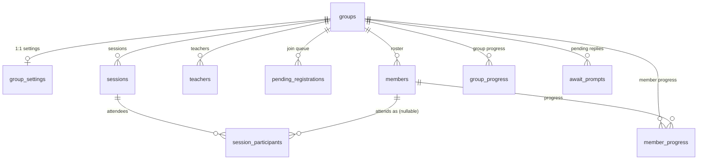
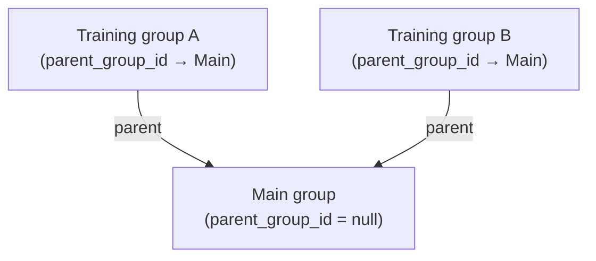
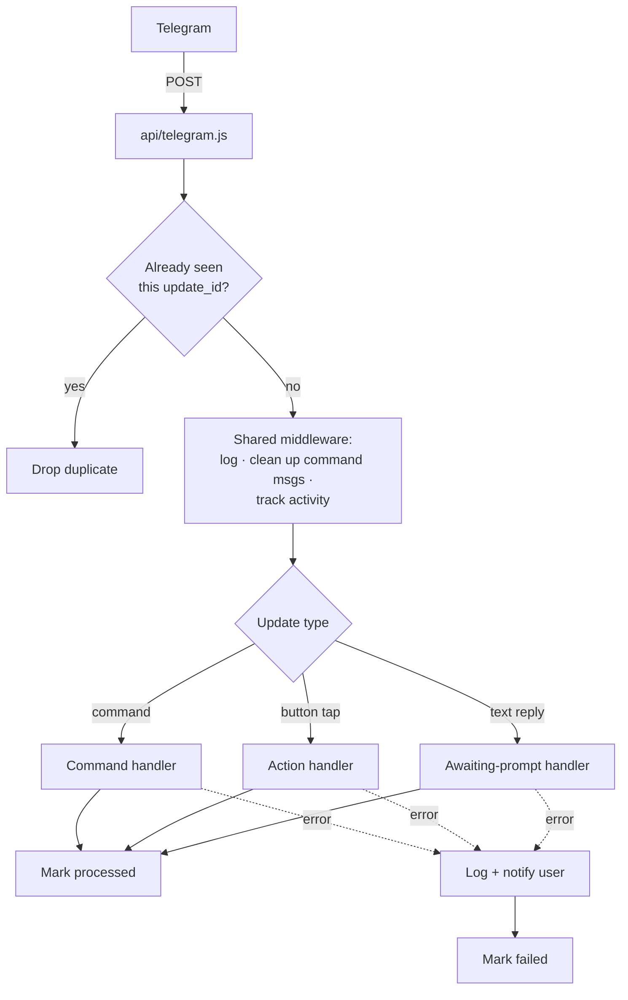
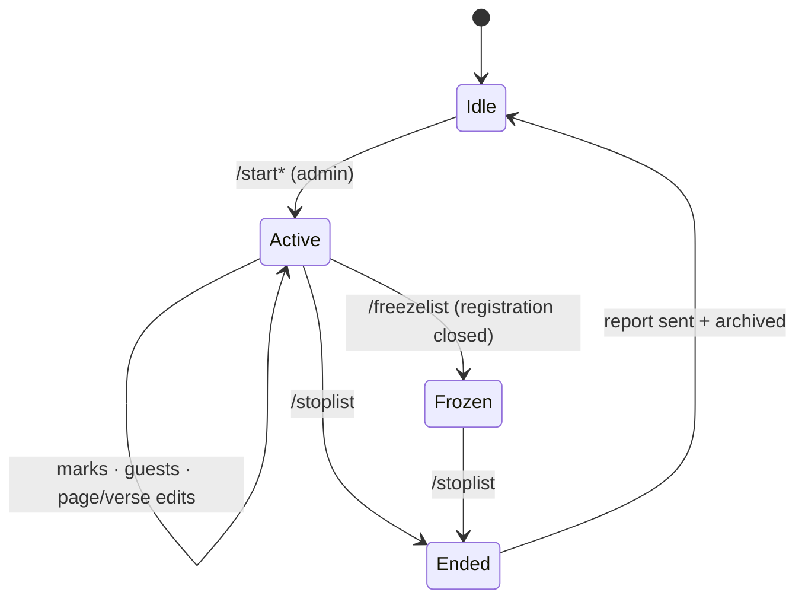
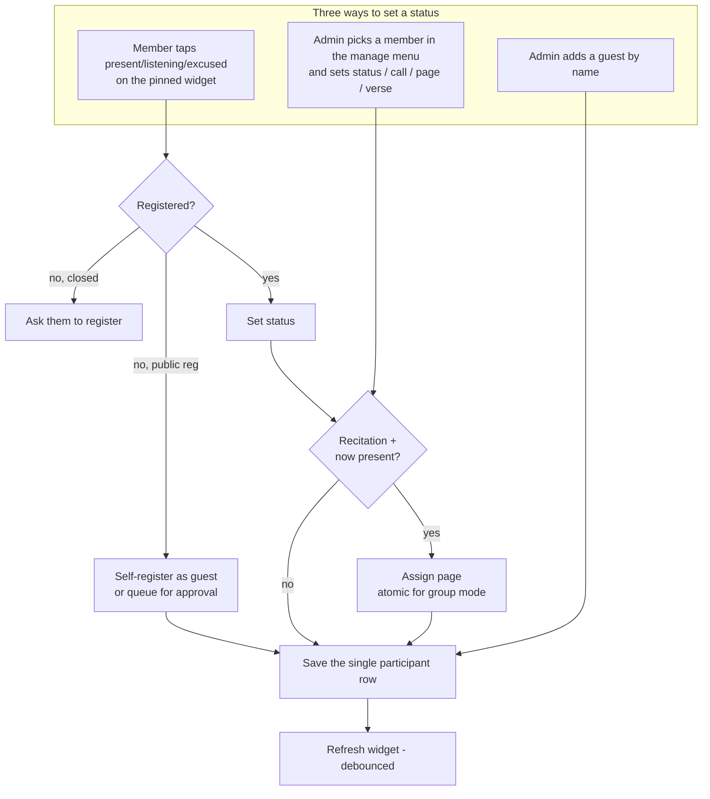
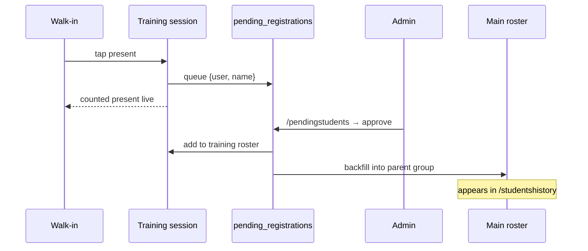
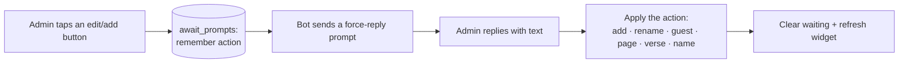

# Bot Flows & Data Model — Deen Circles Attendance Bot

A guided tour of how the bot is wired: the data it stores, how a Telegram
update travels through the code, and the main day-to-day flows. Diagrams are
Mermaid (render in GitHub, VS Code preview, and most Mermaid viewers).

**Mental model in one paragraph:** an admin starts a *session* in a group
(attendance list, recitation, etc.). Members and walk-ins mark themselves
present on a pinned widget, or an admin sets statuses from a manage menu. When
the session stops, a report is sent and the session is archived. Everything is
stored in a Supabase (Postgres) database keyed by *group*.

Contents:
1. [Data model](#1-data-model)
2. [How an update is processed](#2-how-an-update-is-processed)
3. [Commands at a glance](#3-commands-at-a-glance)
4. [Session lifecycle](#4-session-lifecycle)
5. [Marking attendance](#5-marking-attendance)
6. [Registration & members](#6-registration--members)
7. [Training-group walk-ins](#7-training-group-walk-ins)
8. [Text-reply prompts](#8-text-reply-prompts)
9. [History & reports](#9-history--reports)
10. [Appendix: callback prefixes](#10-appendix-callback-prefixes)

---

## 1. Data model

Everything hangs off a **group** (one Telegram chat). A group owns its members,
teachers, pending join requests, sessions, and progress counters. Each session
in turn owns the participant rows that record who attended.

### Relationships



**Group hierarchy (`parent_group_id`).** A group can also point at another group
via `parent_group_id`. This is used one way only: a *training* group names its
*main* group as parent, so approved walk-ins backfill into the main roster (§7).
A main group leaves `parent_group_id` empty.



- **`groups` is the hub** — nearly every table has a `group_id` foreign key back
  to it, and deleting a group cascades to its children.
- **`groups.parent_group_id`** is a self-reference (see the hierarchy diagram
  above): a *training* group points at its *main* group so walk-ins can be
  backfilled (see §7).
- **`session_participants`** joins a session to *either* a member (`member_id`)
  *or* a guest (`guest_name`) — never both.
- **`processed_updates`** is standalone (no foreign keys) — just a dedupe log.

### Every table

```mermaid
erDiagram
    groups {
        bigint id PK
        text telegram_chat_id UK
        text title
        int current_series "term counter"
        timestamptz last_activity_at
        bigint parent_group_id FK "self → main group"
    }
    group_settings {
        bigint group_id PK "FK to groups"
        jsonb training_groups
        int retention_days
    }
    members {
        bigint id PK
        bigint group_id FK
        text telegram_user_id "UK with group"
        text name "UK with group when active"
        bool active
    }
    teachers {
        bigint id PK
        bigint group_id FK
        text telegram_user_id "UK with group"
        text name
        text teacher_type "course/training/recitation"
        bool active
    }
    pending_registrations {
        bigint id PK
        bigint group_id FK
        text telegram_user_id
        text name
        text username
        text status "pending/approved/dismissed"
    }
    sessions {
        uuid id PK
        bigint group_id FK
        text session_type "main/open/training/..."
        text name
        int series_id
        bool active "one active per group"
        bool registration_active
        bool allow_public_registration
        bigint widget_message_id
        int group_recitation_next_page "atomic allocator"
        bool archived
        jsonb metadata
    }
    session_participants {
        bigint id PK
        uuid session_id FK
        bigint member_id FK "null for guests"
        text guest_name "null for members"
        text display_name
        text attendance_status "present/listening/excused/absent"
        text called_state "responding/responded/away"
        text pages
        text verse
    }
    member_progress {
        bigint id PK
        bigint group_id FK
        bigint member_id FK
        text mode "personal/groupRecitation"
        text page_value
    }
    group_progress {
        bigint group_id PK "FK to groups"
        text mode PK "groupRecitation"
        int next_page
    }
    await_prompts {
        bigint id PK
        bigint group_id FK
        text telegram_user_id "UK with group"
        text action
        bigint prompt_message_id
        bool awaiting_prompt
        jsonb payload
        timestamptz expires_at
    }
    processed_updates {
        bigint update_id PK
        text status "processing/processed/failed"
        int retry_count
        text last_error
    }
```



### What each table is for

| Table | Purpose |
|-------|---------|
| `groups` | One row per Telegram chat. `current_series` counts terms; `parent_group_id` links a training group to its main group. |
| `group_settings` | Per-group config: linked training groups, data-retention days. One row per group. |
| `members` | The registered roster. Unique per `(group, telegram_user_id)` and per active name. |
| `teachers` | Course / training / recitation teachers for a group. |
| `pending_registrations` | People who asked to join (`/myid`, register widget) awaiting admin approval. |
| `sessions` | Each attendance run. Only **one** can be `active` per group. Type drives the rules (see §4). |
| `session_participants` | One row per attendee per session — a **member** (`member_id`) or a **guest** (`guest_name`), never both. Holds status, call state, page, verse. |
| `member_progress` | Cross-session recitation position per member (personal / group modes). |
| `group_progress` | Group-wide next recitation page (group mode). |
| `await_prompts` | Tracks "waiting for the admin's next text reply" (see §8). One row per `(group, admin)`. |
| `processed_updates` | Dedupe log so a Telegram retry can't double-process an update. No foreign keys. |

**Two things worth remembering:**
- A participant is a member **or** a guest — the row uses `member_id` for
  registered people and `guest_name` for walk-ins.
- Group-recitation page numbers come from `allocate_group_recitation_page()`, a
  single locked DB update, so simultaneous taps never grab the same page.

---

## 2. How an update is processed

Every Telegram update hits one serverless endpoint, gets de-duplicated, runs
through shared middleware, then reaches the right handler.



- De-duplication only guards the **same** update being redelivered; different
  updates still run as independent, concurrent serverless invocations.
- Command messages in groups are deleted after handling to keep the chat tidy.

---

## 3. Commands at a glance

Access: **A** = admin, **C** = group creator, **—** = anyone.

| Area | Commands |
|------|----------|
| **Info** | `/start` A · `/help` — · `/myid` — · `/groupid` A · `/register` A |
| **Sessions** | `/startlist` `/startopenlist` `/startsecondarylist` `/startpersonalrecitation` `/startgrouprecitation` `/starttraininglist` (all A) · `/freezelist` A · `/stoplist` A · `/lastreport` — |
| **Members** | `/students` A · `/pendingstudents` A · `/addstudent` A · `/removestudent` A · `/removeallstudents` C |
| **Teachers** | `/addteacher` A · `/addteacherreply` A |
| **Training groups** | `/addtraininggroup` `/removetraininggroup` `/listtraininggroups` `/listtrainingstudents` (all A) |
| **History** | `/classhistory` A · `/studentshistory` A · `/newclass` C · `/removeclassrecord` C · `/removestudentrecord` C |
| **Utility** | `/sortnames` A · `/tagstudents` A · `/feedback` — |

Handlers live under `lib/handlers/commands/`.

---

## 4. Session lifecycle

Only **one** session is active per group. Types differ in who may register and
what extra data is tracked.



On **stop**: a report is posted and the session archived. `main` sessions bump
the group's series counter; recitation sessions carry the next page forward.

| Type | Command | Who can register | Extra tracking |
|------|---------|------------------|----------------|
| `main` | `/startlist` | Registered only | — |
| `open` | `/startopenlist` | Registered + walk-ins | — |
| `training` | `/starttraininglist` | Registered + walk-ins (public) | Walk-ins backfill to parent group |
| `registeredSecondary` | `/startsecondarylist` | Registered only | Verse per member |
| `personalRecitation` | `/startpersonalrecitation` | Registered only | Auto page, cumulative per member |
| `groupRecitation` | `/startgrouprecitation` | Registered only | Auto page, sequential (atomic allocator) |

---

## 5. Marking attendance

A status can be set three ways. Recitation sessions auto-assign a page when
someone becomes "present".



Saves touch only that one participant row (not the whole session), so
concurrent taps can't clobber each other.

---

## 6. Registration & members

```mermaid
flowchart TD
    ASK[User: /myid or register widget] --> Q[(pending_registrations)]
    Q --> REVIEW[Admin: /pendingstudents]
    REVIEW -->|approve| ADD[Add to roster<br/>· optionally as teacher]
    REVIEW -->|dismiss| DROP[Soft-dismiss]

    MANAGE[Admin: /students] --> RENAME[Rename]
    MANAGE --> DELETE[Remove]
    MANAGE --> ASSIGN[Assign to a training group]
    QUICK[/addstudent · /removestudent] --> ADD

    ADD --> LIVE{Session active?}
    LIVE -->|yes| SYNC[Add to session + refresh widget]
    LIVE -->|no| OK[Done]
```

`/removeallstudents` (creator only) wipes the roster and all sessions behind a
confirmation prompt.

---

## 7. Training-group walk-ins

A training group links to a main group via `groups.parent_group_id`. Walk-ins
in a training session are **queued, not auto-added**; approving them also
backfills the parent group's roster so their attendance shows up in reports.



---

## 8. Text-reply prompts

Some actions need free text (a name, a page, a verse). The bot records what it's
waiting for, then the admin's next reply is consumed and applied.



Waiting actions: add member, rename, edit pending registration, add guest, edit
session name, edit page, edit verse. (`/feedback` uses a separate mechanism.)

---

## 9. History & reports

```mermaid
flowchart TD
    CH[/classhistory] --> S1[Pick a term/series]
    S1 --> S2[View full report]
    S1 --> S3[Edit a past session]
    S3 --> S4[Pick a member → change status]

    SH[/studentshistory] --> T[Per-student tally:<br/>main attendance · latest verse ·<br/>training attendance]

    RM[Creator-only removals] --> RC[/removeclassrecord]
    RM --> RS[/removestudentrecord]
    RM --> NC[/newclass → next series]
    RC & RS & NC --> CONFIRM[Confirmation token required]
```

---

## 10. Appendix: callback prefixes

Button taps carry a compact `prefix:...` payload. For contributors:

| Prefix | Meaning | File |
|--------|---------|------|
| `a:*` | Attendance self-mark / refresh | `actions/attendance.js` |
| `sm:*` | Session manage (status, call, page, verse, guest) | `actions/manage.js` |
| `mb:*` | Member roster management | `actions/members.js` |
| `mb:atrain*` | Assign member to a training group | `actions/groups.js` |
| `pr:*` | Pending registrations / register widget | `actions/members.js` |
| `h:*` | History browse & edit | `actions/history.js` |
| `cf:ok` / `cf:cancel` | Creator-action confirmation | `actions/confirm.js` |
| `aw:cancel` | Cancel a text-reply prompt | `actions/manage.js` |
| `msg:dismiss` | Delete an inline widget | `actions/history.js` |
